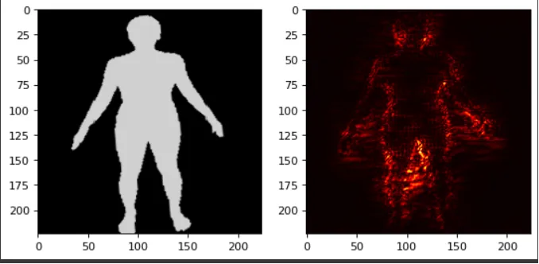
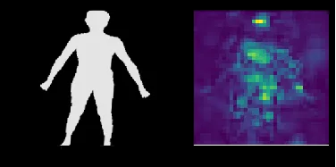

# xai-saliency-maps

If you are looking to get more insight into your image neural network, like I was, here are 2 good ways you can do it. Both methods approach this problem, with the idea of saliency of a picture.

## Table of Contents
  * [What are Saliency Maps?](#what-are-saliency-maps)
    + [Saliency](#Saliency)
    + [Occlusion](#Occlusion)

## What are Saliency Maps?

Oxford definition: Prominence, The quality of being particularly noticeable or important.

In our case, our goal is to score saliency for each pixel-value in the image.

First introduced in Zeiler and Fergus, “Visualizing and Understanding Convolutional Networks”, ECCV 2014, this technique brought the idea of occluding part of an image, to identify how “important” was that segment to the prediction of our model.

## Saliency



First introduced in Simonyan, Vedaldi, and Zisserman, “Deep Inside Convolutional Networks: Visualising Image Classification Models and Saliency Maps”, ICLR Workshop 2014, this approach introduced a technique that will generate an image map which maximizes the output score.

### We can use Tensorflow GradientTape():

1. Getting the model loss function, and preparing our data.
2. Predicting with the model and calculating the loss, and using automatic differantiation.
3. Calculate the loss gradient with respect to the original image.

## Occlusion



1. Adding an occlusion map in the original picture.
2. Calculating the amount of error that is added in the prediction.
3. Attributing the error to the occluded pixels.

## Citation

If you find this code useful for your research, please cite the following:

```
@misc{Kotani2023TensorflowSaliencyMaps,
  author = {Gabriel Kotani},
  title = {xai-saliency-maps},
  year = {2023},
  publisher = {GitHub},
  journal = {GitHub repository},
  howpublished = {\url{https://github.com/Gab314/xai-saliency-maps}},
}
```

## References
+ [Visualizing and Understanding Convolutional Networks](https://arxiv.org/abs/1311.2901)
+ [Deep Inside Convolutional Networks: Visualising Image Classification Models and Saliency Maps](https://arxiv.org/abs/1312.6034)

## Connect with me

* Follow me on [LinkedIn](https://www.linkedin.com/in/gabriel-kotani/) :books:
* Follow me on [Medium](https://medium.com/@gabriel.o.k) :heart: